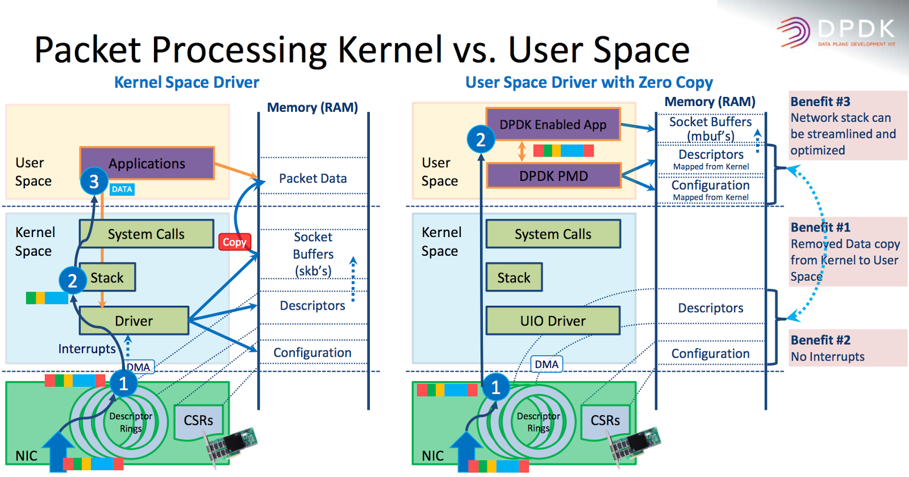

# K3 GMAC DPDK User Guide

## DPDK Overview

DPDK (Data Plane Development Kit) is an open source project hosted by the Linux Foundation. Originally created by Intel in 2010, it has become a widely adopted high-performance packet processing acceleration framework. DPDK is a collection of user-space libraries and drivers designed to accelerate packet processing workloads on various CPU architectures, including Intel x86, ARM, and RISC-V.

Official website: [DPDK](https://www.dpdk.org/)

### DPDK Framework

DPDK is a highly modular, layered user-space data plane development framework. Its architecture follows the principles of low-level abstraction, core reusability, and upper-layer extensibility, providing end-to-end support from hardware acceleration to application logic.

The DPDK framework is shown below:


### DPDK Components

DPDK consists of multiple libraries and drivers that work together to form a complete high-performance packet processing framework.

#### Core Libraries

* **Environment Abstraction Layer (EAL)**

       Provides a hardware- and OS-independent interface for accessing low-level resources such as hardware devices and memory.

* **Ring Buffer Library (RING)**

       Provides a lock-free, multi-producer, multi-consumer FIFO queue.

* **Memory Pool Library (MEMPOOL)**

       Manages allocation and deallocation of packet buffers.

* **Packet Buffer Library (MBUF)**

       Manages packet buffers (`mbuf`), including the allocation, deallocation, and manipulation of packet data.

* **Timer Library (TIMER)**

       Provides asynchronous timer services based on the EAL time reference.

#### Poll Mode Driver (PMD)

PMDs are the core driver components for high-performance packet I/O in DPDK. DPDK includes PMDs for 1-Gigabit, 10-Gigabit, and 40-Gigabit interfaces, as well as para-virtualized virtio interfaces.

#### Classify Libraries

* **Exact Match**

       Used for exact-match flow-table lookups, such as OpenFlow 5-tuple matching, with very high lookup performance.

* **LPM Library**

       Implements the Longest Prefix Match algorithm, primarily used for IPv4 routing lookups.

* **ACL (Wildcard Match)**

       Provides access control lists with multi-field rule matching on source and destination IP addresses, ports, and protocols. Used for firewalls and access control.

#### QoS Library

The QoS (Quality of Service) framework provides traffic management capabilities, including policing, buffering, and scheduling.

#### Extension Libraries (Extns)

* **Packet Framework**

       Provides a standard method for building complex packet-processing pipelines by connecting input and output ports through lookup tables arranged in a tree topology.

* **Kernel NIC Interface (KNI)**

       Works with the kernel KNI module to forward packets to the kernel networking stack from user space.

* **Power Management**

       Provides CPU power management with load-based dynamic frequency scaling (C-states) and sleep strategies to reduce idle power consumption.

#### Applications

* **DPDK Sample Apps**

       Command-line test tools bundled with DPDK for validating NIC PMD functionality and performance.

* **Customer Apps**

       Custom applications such as vSwitches, load balancers, firewalls, and IDS/IPS systems.

### DPDK Core Principles

DPDK achieves microsecond-level latency and line-rate forwarding performance through two key techniques: kernel bypass and Poll Mode Drivers (PMDs).

* **Kernel Bypass**

  DPDK completely bypasses the Linux kernel network stack:

       **1. User-space access:** Uses UIO (User Space I/O) or VFIO drivers to map NIC registers and I/O directly into user space.

       **2. Zero-copy:** The NIC uses DMA to copy packets directly into hugepage-backed memory buffers (`mbuf`) in user space. The DPDK-enabled application reads these buffers directly, eliminating data copies between kernel and user space.

* **Poll Mode Driver (PMD)**

       In high-throughput scenarios, traditional interrupt-driven I/O causes excessive CPU interrupt overhead. DPDK addresses this with PMDs:

       **1. No interrupts:** The PMD runs in user space and dedicates CPU cores to continuously poll the NIC receive queues (Rx queues). Once a packet arrives, the PMD reads the descriptor ring directly in user space without waiting for an interrupt.

       **2. No system calls:** The entire packet I/O path requires no blocking system calls such as `recv` or `send`, eliminating kernel context-switch overhead.




## Kernel Configuration

Configure and load the `stmmac_uio` driver as follows.

### Kernel Configuration

```config
CONFIG_HUGETLBFS=y
CONFIG_UIO=y
CONFIG_STMMAC_UIO=m
```

### DTS Configuration

Enable the `stmmac_uio` driver in the board's DTS file.

```dts
&gmac_uio0 {
        status = "okay";
};

&gmac_uio1 {
        status = "okay";
};
```

## Performance Tuning

### CPU Isolation (isolcpus)

Isolate specific CPU cores from the kernel scheduler to prevent kernel threads and regular user-space processes from preempting them. The isolated cores are dedicated to DPDK data-plane processing.

**Configuration:** Add `isolcpus=2,3` to the kernel boot parameters.

```diff
 chosen {
-               bootargs = "earlycon=sbi console=ttyS0,115200 loglevel=8 random.trust_bootloader=1 unaligned_scalar_speed=fast unaligned_vector_speed=fast";
+               bootargs = "earlycon=sbi console=ttyS0,115200 loglevel=8 isolcpus=2,3 nohz_full=2,3 rcu_nocbs=2,3 random.trust_bootloader=1 unaligned_scalar_speed=fast unaligned_vector_speed=fast";
                rng-seed = <0x25d69b2 0xff555073 0xd23238ea 0x57aa5455 0x792478ed 0xa744f28e 0x6ba4fc54 0xa2bf20fc>;
                stdout-path = "serial0:115200";
        };
```

This example isolates CPUs 2 and 3. The system scheduler will not automatically schedule tasks on the isolated cores.

### Tickless Kernel (nohz_full)

Reduce timer interrupts on isolated cores by putting them into tickless mode. This significantly lowers interrupt overhead and improves the determinism of packet processing.

#### Kernel Configuration

```config
CONFIG_NO_HZ_FULL=y
CONFIG_RCU_NOCB_CPU=y
```

#### Kernel Boot Arguments

Add the following parameters to the kernel command line for the cores that require tickless mode. The range must match the `isolcpus` setting.

```dts
bootargs = "earlycon=sbi console=ttyS0,115200 loglevel=8 isolcpus=2,3 nohz_full=2,3 rcu_nocbs=2,3 random.trust_bootloader=1 unaligned_scalar_speed=fast unaligned_vector_speed=fast";
```

`rcu_nocbs=2,3` moves RCU callbacks to non-isolated cores.

### Disable Serial Console

Disable the serial console to reduce CPU interference from console output.

### Verification

To check CPU isolation, run `cat /sys/devices/system/cpu/isolated`. The command should output `2,3`.

To check tickless mode, run `cat /sys/devices/system/cpu/nohz_full`. The command should output `2,3`.

## DPDK Installation

### Download the Source Code

```
https://github.com/spacemit-com/dpdk-spacemit.git
```

### Install the Dependencies

```bash
sudo apt update
sudo apt install -y build-essential clang llvm libelf-dev
sudo apt install -y meson ninja-build pkg-config libnuma-dev
sudo apt install -y python3-pyelftools libpcap-dev m4 libbsd-dev
```

### Compile DPDK

```bash
cd /root/dpdk/dpdk
meson setup -Dplatform=spacemit_k3 build
cd build
ninja
ninja install
ldconfig
```

## DPDK Testing

### testpmd

#### Test Command
```bash
echo 1024 > /sys/kernel/mm/hugepages/hugepages-2048kB/nr_hugepages
sudo mkdir -p /mnt/huge
sudo mount -t hugetlbfs nodev /mnt/huge
modprobe uio
modprobe stmmac_uio
dpdk-testpmd --iova-mode=pa --vdev=net_stmmac0 --vdev=net_stmmac1 -l 0,2,3 --main-lcore=0 -- --nb-cores=2 -i --txd=1024 --rxd=1024
```

#### Description

Uses CPU cores 2 and 3 to poll and process packets on two `stmmac` virtual NICs at high speed. Interactive mode (`-i`) is enabled, allowing you to enter commands such as `start`, `stop`, and `show port stats all` at runtime to control forwarding and monitor packet drops and throughput in packets per second (PPS).

#### Parameter Reference

* `--iova-mode=pa`

       Because the GMAC does not support an IOMMU, set IOVA mode to physical-address (PA) mode.

* `--vdev=net_stmmac0 --vdev=net_stmmac1`

       Specifies the virtual devices corresponding to `eth0` and `eth1`.

* `-l 0,2,3`

       Specifies the list of CPU cores available to DPDK.

* `--main-lcore=0`

       Uses core 0 for management and cores 2 and 3 for packet forwarding.

* `--`

       Separates EAL parameters from `testpmd` application parameters.

* `--nb-cores=2`
       
       Specifies the number of worker cores used for packet forwarding.

* `-i`

       Starts `dpdk-testpmd` in interactive command mode.

* `--txd=1024`

       Sets the number of transmit descriptors for each port to 1024.

* `--rxd=1024`

       Sets the number of receive descriptors for each port to 1024.

### l2fwd

#### Test Command

```bash
echo 1024 > /sys/kernel/mm/hugepages/hugepages-2048kB/nr_hugepages
sudo mkdir -p /mnt/huge
sudo mount -t hugetlbfs nodev /mnt/huge
modprobe uio
modprobe stmmac_uio
./l2fwd -l 0,2,3 --main-lcore=0 --iova-mode=pa --vdev=net_stmmac0 --vdev=net_stmmac1 -- -p 0x3 -q 1
```

#### Description

Performs bidirectional Layer 2 forwarding, similar to a bridge, between two virtual NICs (`net_stmmac0` and `net_stmmac1`). Packets received on port 0 are sent through port 1, and packets received on port 1 are sent through port 0.

#### Parameter Reference

* EAL parameters

       Parameters before `--`. Their meanings are the same as those of the `testpmd` options.

* `-p 0x3`

       Hexadecimal port mask that controls which NIC ports are enabled. In binary, `0x3` is `0011`, which enables Port 0 and Port 1, the two configured vdevs.

* `-q 1`

       Specifies the number of receive queues handled by each CPU core.

### l3fwd

#### Test Command
```bash
echo 1024 > /sys/kernel/mm/hugepages/hugepages-2048kB/nr_hugepages
sudo mkdir -p /mnt/huge
sudo mount -t hugetlbfs nodev /mnt/huge
modprobe uio
modprobe stmmac_uio
./l3fwd -l 2 --iova-mode=pa --vdev=net_stmmac0 --vdev=net_stmmac1 -- -p 0x3 -P --config="(0,0,2),(1,0,2)" --parse-ptype
```

#### Description

Performs Layer 3 packet forwarding at the IP routing layer between two virtual NICs (`net_stmmac0` and `net_stmmac1`). A single core (CPU 2) polls both NIC ports. After receiving a packet, the application parses the IP header and uses the built-in routing table to determine the forwarding port.

#### Parameter Reference

* EAL parameters

       Parameters before `--`. Their meanings are the same as those of the `testpmd` options.

* `-p 0x3`

       Hexadecimal port mask that controls which NIC ports are enabled. In binary, `0x3` is `0011`, which enables Port 0 and Port 1, the two configured vdevs.

* `-P`

       Enables promiscuous mode. The NIC accepts all incoming packets without checking whether the destination MAC address matches its own MAC address.

* `--config="(0,0,2),(1,0,2)"`

       Maps cores, ports, and NIC receive queues. `(0,0,2)` assigns receive queue 0 of Port 0 (`net_stmmac0`) to CPU 2. `(1,0,2)` assigns receive queue 0 of Port 1 (`net_stmmac1`) to CPU 2 as well.

* `--parse-ptype`

       Forces software packet-type parsing.

## FAQ

### Get The Detailed Log

* `dpdk-testpmd --log-level=help`

       Displays all valid log types and levels supported by the current DPDK build.

       ```text
       Log type is a pattern matching items of this list (plugins may be missing):
        bus.auxiliary
        bus.cdx
        bus.dpaa
        bus.fslmc
        bus.ifpga
        bus.pci
        bus.platform
        ...
       Syntax using globbing pattern:     --log-level pattern:level
       Syntax using regular expression:   --log-level regexp,level
       Syntax for the global level:       --log-level level
       Logs are emitted if allowed by both global and specific levels.

       Log level can be a number or the first letters of its name:
        1   emergency
        2   alert 
        ...
       ```

* `--log-level=pmd.net.stmmac:debug`

       Raises the log level for the DPDK `stmmac` driver to `debug`. The default level is `notice`.

       ```
       dpdk-testpmd --iova-mode=pa --vdev=net_stmmac0 --vdev=net_stmmac1 -l 0,2,3 --main-lcore=0 -n 4 --log-level=pmd.net.stmmac:debug -- --forward-mode=flowgen --nb-cores=2 -i --txd=1024 --rxd=1024
       ```

* `--log-level=pm.lib.eal:debug`

       Raises the log level for the core `lib.eal` component to the most detailed `debug` level.

### testpmd Fails to Start: Cannot Get Hugepage Information

* Error output:

       ```
       # dpdk-testpmd --iova-mode=pa --vdev=net_stmmac0 --vdev=net_stmmac1 -l 0,2,3 --main-lcore=0 -n 4 -- --forward-mode=flowgen --nb-cores=2 -i --txd=1024 --rxd=1024                      
       EAL: Detected CPU lcores: 8
       EAL: Detected NUMA nodes: 1
       EAL: Detected static linkage of DPDK
       EAL: Multi-process socket /var/run/dpdk/rte/mp_socket
       EAL: Selected IOVA mode 'PA'
       EAL: Cannot get hugepage information.
       EAL: Error - exiting with code: 1
       Cannot init EAL: Permission denied
       ```

* Cause:
       
       No hugepages are reserved in the kernel, or the hugepage filesystem is not mounted at `/dev/hugepages`.

* Resolution:

       **Check the current hugepage state:**

       ```bash
       cat /proc/meminfo | grep -i huge
       ```

       Check whether `HugePages_Total` and `HugePages_Free` are 0. If both values are 0, no hugepages have been allocated.

       **Allocate 2 MB hugepages dynamically:**

       ```bash
       echo 256 > /sys/kernel/mm/hugepages/hugepages-2048kB/nr_hugepages
       ```

       **Check and manually mount the hugetlbfs filesystem:**
       
       DPDK reads memory segment information through files at the mount point. Run the following commands to mount the filesystem manually:

       ```bash
       mkdir -p /dev/hugepages
       mount -t hugetlbfs nodev /dev/hugepages
       ```

       After mounting, retry starting `testpmd` to confirm that the error is resolved.